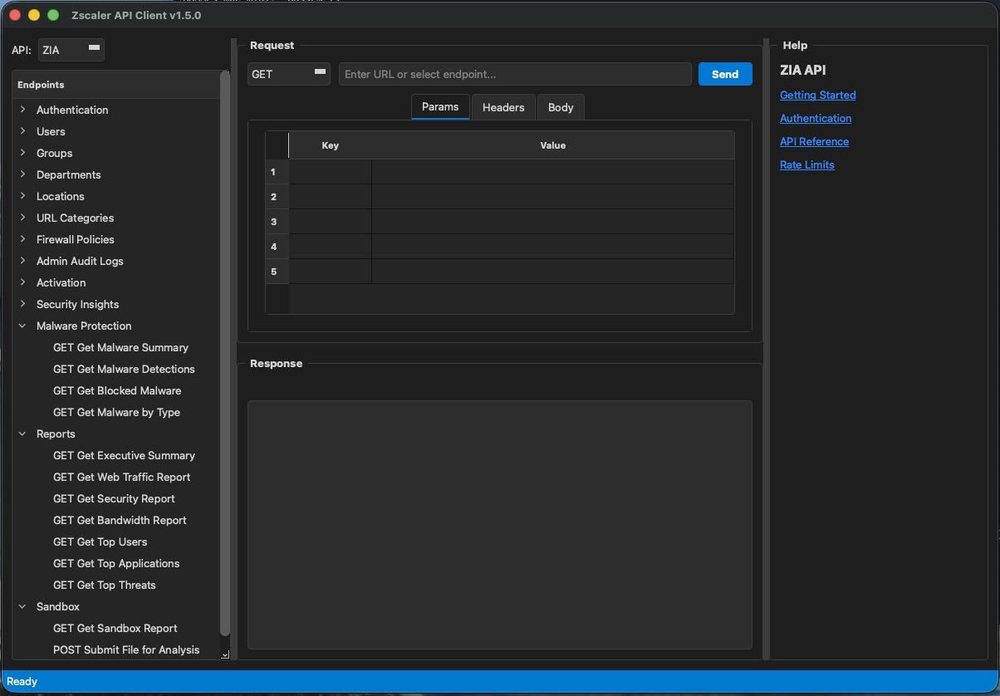

# Zscaler API Client

🔐 A Postman-like desktop application for Zscaler APIs (ZIA, ZPA, ZDX, ZCC)



## Features

- **API Explorer** – Browse ZIA, ZPA, ZDX, and ZCC endpoints with documentation
- **Request Builder** – Build requests with params, headers, and JSON body
- **JSON Highlighting** – Syntax highlighting for responses
- **Batch Operations** – Import CSV for bulk create/delete/update
- **Request History** – Browse and reload previous requests
- **Copy as cURL** – Export requests for command-line use
- **Multi-language** – English, Swedish, German, French, Spanish, Japanese, Chinese
- **Secure Storage** – Credentials stored in system keychain
- **Advanced Settings** – Timeouts, proxy, SSL verification, themes
- **Light/Dark Themes** – Full theme support with system auto-detection
- **Splash Screen** – Professional startup experience
- **Welcome Guide** – Getting started help for new users
- **Inline Documentation** – Links to API docs for each endpoint

## Supported APIs

### ZIA (Zscaler Internet Access)
- Authentication
- Users, Groups, Departments
- Locations
- URL Categories & Lookup
- Firewall Policies
- Admin Audit Logs
- Activation

### ZPA (Zscaler Private Access)
- Authentication (OAuth)
- Application Segments
- Segment Groups
- Server Groups
- Connectors
- Access Policies
- SAML Attributes

### ZDX (Zscaler Digital Experience)
- Authentication (OAuth)
- Administration (Departments, Locations, Geolocations)
- Devices & Health Metrics
- Users & Scores
- Applications & Performance
- Alerts
- Web Probes
- Deep Traces

### ZCC (Client Connector)
- Authentication (OAuth)
- Device Management
- **Compliance Status** (compliant/non-compliant devices)
- Posture Profiles
- Software Versions & Updates
- Enrollment Tokens
- Troubleshooting & Logs

## Installation

### Requirements
- Python 3.9+
- PyQt6 or PySide6

### Install
```bash
pip install PyQt6
git clone https://github.com/yeager/zscaler-api-client.git
cd zscaler-api-client
python zscaler_api_client.py
```

### macOS App Bundle (coming soon)
```bash
pip install pyinstaller
pyinstaller --windowed --name "Zscaler API Client" zscaler_api_client.py
```

## Usage

### 1. Configure Credentials
Go to **File → Settings** and enter your Zscaler credentials:

**ZIA:**
- Cloud (e.g., `zsapi.zscaler.net`)
- API Key
- Admin Username
- Admin Password

**ZPA:**
- Cloud (e.g., `config.private.zscaler.com`)
- Client ID
- Client Secret
- Customer ID

### 2. Browse Endpoints
Select **ZIA** or **ZPA** from the dropdown, then click on an endpoint in the tree to load it.

### 3. Send Request
1. Modify the URL, params, headers, or body as needed
2. Click **Send**
3. View the JSON response with syntax highlighting

### 4. Batch Operations
Go to **File → Batch Operations** to:
1. Import a CSV file
2. Select the operation (Create Users, Delete Users, etc.)
3. Execute in bulk

### CSV Format Examples

**Create Users (ZIA):**
```csv
name,email,department_id,group_ids
John Doe,john@example.com,123,"[456,789]"
Jane Doe,jane@example.com,123,"[456]"
```

**URL Lookup (ZIA):**
```csv
url
example.com
test.com
malware.com
```

## Keyboard Shortcuts

| Shortcut | Action |
|----------|--------|
| Ctrl+Enter | Send Request |
| Ctrl+, | Settings |
| Ctrl+B | Batch Operations |
| Ctrl+H | Request History |
| Ctrl+Shift+C | Copy as cURL |
| Ctrl+Shift+R | Copy Response |
| Ctrl+Q | Quit |

## Languages

The application supports:
- 🇬🇧 English (default)
- 🇸🇪 Svenska
- 🇩🇪 Deutsch
- 🇫🇷 Français
- 🇪🇸 Español
- 🇯🇵 日本語
- 🇨🇳 中文

Change via **Language** menu.

## API Documentation

- [ZIA API Reference](https://help.zscaler.com/zia/api)
- [ZPA API Reference](https://help.zscaler.com/zpa/api-reference)
- [Zscaler API Portal](https://automate.zscaler.com/)

## Security

- Credentials are stored securely using QSettings (platform keychain on macOS)
- API sessions are automatically terminated when the app closes
- No telemetry or external connections except to Zscaler APIs

## Disclaimer

⚠️ **This software is NOT affiliated with, endorsed by, or supported by Zscaler, Inc. in any way.** This is an independent community project.

- Zscaler® is a registered trademark of Zscaler, Inc.
- All product names, logos, and brands are property of their respective owners.
- **NO WARRANTY:** This software is provided "as is" without warranty of any kind. Use at your own risk.
- **NO SUPPORT:** For Zscaler product support, please contact Zscaler directly through official channels.

The author is not responsible for any damage or data loss resulting from the use of this software.

## License

GPL-3.0-or-later

## Author

**Daniel Nylander** ([@yeager](https://github.com/yeager))

## Acknowledgments

Thanks to **Nima Samadi** for feature suggestions (ZDX, ZCC, compliance, splash screen, user guidance).
