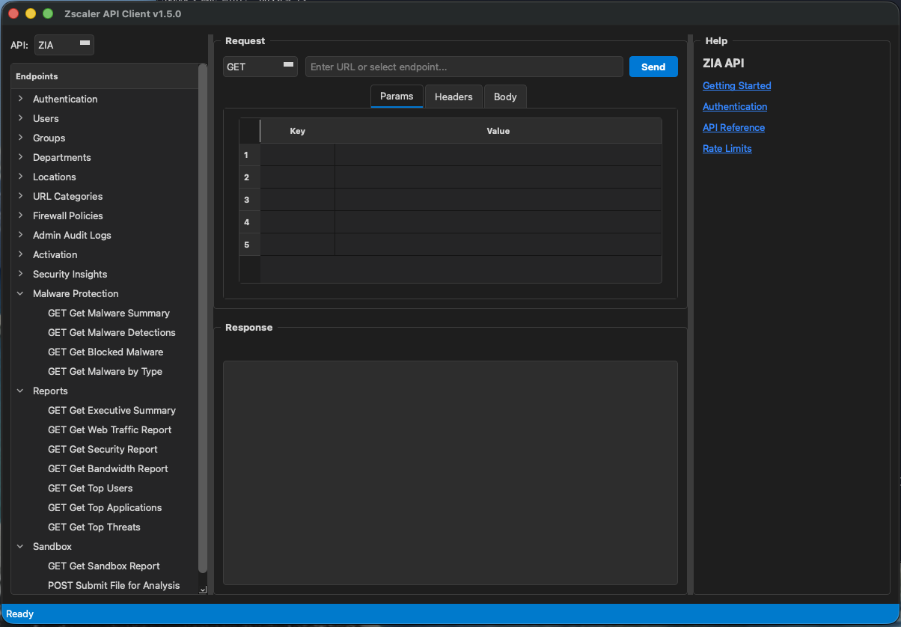

# ZS API Client

🔐 A Postman-like desktop application for all Zscaler APIs

[](https://github.com/yeager/zscaler-api-client/releases)
[](LICENSE)
[](https://github.com/yeager/zscaler-api-client/releases)



## 🛡️ Security First

ZS API Client is built with security as a top priority:

### Credential Security
- **System Keychain Integration** – All credentials stored securely in macOS Keychain, Windows Credential Locker, or Linux Secret Service
- **No Plain Text Storage** – Sensitive data never written to disk in readable format
- **Memory Protection** – Credentials cleared from memory when not in use

### Update Security
- **Verified Updates** – Update checker verifies releases from trusted GitHub repository only
- **Author Verification** – Only accepts releases from verified maintainer (yeager)
- **SSL Enforcement** – All update checks use HTTPS with certificate verification
- **Pre-release Warnings** – Clearly indicates when a release is a pre-release version

### API Security
- **Per-Session Tokens** – Each API type maintains its own authentication token
- **Product-correct legacy authentication** – Supports ZIA `JSESSIONID`, ZPA bearer tokens, ZDX v1/v2 bearer tokens, and Client Connector `auth-token` JWT sessions
- **Automatic Session Cleanup** – Sessions terminated when app closes
- **No Telemetry** – Zero tracking, analytics, or external connections except Zscaler APIs
- **OAuth 2.0 Support** – Modern authentication for all newer APIs

## ✨ Features

### API Coverage
- **Automation Hub catalog** – 1,000+ executable REST operations generated from
  [Zscaler Automation Hub](https://automate.zscaler.com), including:
  - AI Security, Business Insights, EASM, Event Monitoring, and URBAC
  - ZIA (Zscaler Internet Access)
  - ZPA (Zscaler Private Access)
  - ZDX (Zscaler Digital Experience)
  - ZCC (Client Connector)
  - ZIdentity (Identity & Access Management)
  - Zscaler Cellular and Cloud/Branch Connector
  - ZWA (Workflow Automation)
- **Reproducible updates** – `python3 scripts/update_api_catalog.py` refreshes
  the bundled REST and ZInsights GraphQL catalogs directly from the official documentation index.
- **ZInsights GraphQL** – Browse all 28 documented analytics queries and 77 schema
  types, load official query examples for review, or introspect an authenticated endpoint.

### Developer Experience
- **1,000+ Endpoints** – Browse all executable Automation Hub REST operations in an organized tree view
- **Inline Documentation** – Direct links to official Zscaler API docs for each endpoint
- **API Guide contracts** – Inspect documented query, path, and header fields with types, required flags, defaults, body templates, and response codes directly in the request editor
- **Complete collection reads** – Explicitly follow documented numbered, offset, or cursor pagination with hard page/transfer limits, retained page envelopes, and partial-result warnings
- **Rate-limit-aware reads** – Safely retry only idempotent GET, HEAD, and OPTIONS requests with cancellable, bounded `Retry-After`/exponential backoff; write requests are never retried automatically
- **Documentation-grounded AI** – Natural-language matches attach the same request contract and suggest only parameters published for that operation
- **Request Builder** – Full control over URL, params, headers, and JSON body
- **Dataflow chains** – Build reviewed, same-host workflows where later requests safely reference earlier JSON values; inspect a status chart/table and export masked evidence
- **Complete HTTP bodies** – Send JSON, raw text, URL-encoded forms, or multipart file uploads without persisting local file paths
- **Binary downloads** – Preserve CSV, ZIP, PDF, certificates, and other files byte-for-byte with safe filenames, explicit export confirmation, and configurable transfer limits
- **Syntax Highlighting** – Beautiful JSON response formatting
- **Copy as cURL** – Export any request for command-line use or scripting
- **Request History** – Browse redacted requests by tenant environment; cross-environment replay is blocked until the matching profile is active
- **Adaptive response views** – Inspect masked JSON as a table, chart, tree, heatmap, topology, or GraphQL schema; use export preview to review masking before writing a file
- **Purpose-built visual design** – Responsive zero-trust, investigation, and executive-report artwork enrich onboarding and operational empty states without replacing accessible data views
- **Complete GraphQL envelopes** – Preserve and display `data`, `errors`, and `extensions`, including partial-success responses
- **Portable response exchanges** – Save a versioned, masked request/response package and reopen it locally for investigation without restoring credentials or sending a request
- **Environment and response drift** – Compare an active masked response with a saved baseline, align inventories by stable record identity, ignore configured volatile fields, visualize impact, and export masked evidence without network access
- **Complete response exports** – Export masked data as JSON, YAML, XML, CSV, XLSX, NDJSON, Markdown, HTML, multi-page PDF, HAR, PNG, or SVG; explicit table exports retain the full source dataset
- **Typed GraphQL variables** – Extract operation variables into a guided editor, validate required values and nested list/scalar types, and insert them into `body.variables` rather than URL parameters

### Productivity
- **Batch Operations** – Import CSV files for bulk create/delete/update operations
- **Operations Center** – Local policy diffs and simulations, CSV validation, isolated environment profiles, dashboards, report schedules, and a hash-linked audit trail
- **Digital Policy Twin** – Visualize first-match rule order, explain local decisions, detect overlapping actions, conflicts, redundant or fully shadowed rules, estimate change blast radius, and compare tenant-scoped time-travel snapshots without applying configuration
- **Accelerated SOC telemetry** – Render longer live latency series with pyqtgraph downsampling and clipping, with a Qt-native fallback for minimal or offline source installations
- **Digital experience journey** – Turn complete ZDX or OneAPI REST/GraphQL responses into an observed user → device → network → service-edge → application path, explicit data gaps, issue cards, tables, and accelerated trends
- **Explainable Detection Lab** – Test bounded declarative rules and adaptive median/MAD anomaly thresholds against masked local history without code execution, tenant writes, external transfer, or automatic remediation
- **Change safety and response workflows** – Score policy-change risk, require visible pre-change gates, create and verify integrity-protected rollback artifacts, track guided playbooks, and rank documented API operations into review-only read-first plans
- **Secure integration handoffs** – Export masked local events as JSON Lines, CEF, or LEEF; create a non-executable Terraform review archive; and generate a least-privilege, read-only MCP manifest without installing, starting, or contacting anything
- **SOC Investigation Workspace** – Correlate retained activity, request bodies, audit details, and complete REST/GraphQL response trees into a privacy-safe entity graph, explainable signals, and explicitly non-authoritative potential attack paths; export JSON, GraphML, CSV edge lists, or PNG
- **Continuous assurance** – Evaluate explicit local controls with tenant-scoped baselines, NIST CSF 2.0/CISA Zero Trust navigation, deterministic leadership narratives, score trends, and offline-verifiable Ed25519 evidence packages whose private key remains in the system keychain
- **Tenant-safe environments** – Keep product hosts, client identifiers, enabled APIs, workspace state, and system-keychain credentials separate per environment; switching clears all in-memory sessions, requests, and responses
- **Tenant-scoped operations** – Dashboards, posture, anomalies, incidents, audit views, integrations, support bundles, and reports default to the active environment; Advanced mode provides an explicit cross-tenant overview
- **Configurable privacy boundary** – Credentials are always masked; exports, clipboard data, external AI, webhooks, local automation input, support bundles, scheduled reports, and chart images pseudonymize users, addresses, hosts, tenants, object IDs, and policy/resource labels by default
- **Stable local pseudonyms** – A system-keychain-backed HMAC seed keeps correlations useful without storing an original-to-pseudonym map; Settings provides synthetic preview, category controls, an optional on-screen privacy mode, and explicit seed rotation
- **Background reports** – Optionally register user-level Windows Task Scheduler, macOS LaunchAgent, or Linux systemd jobs so redacted reports run while the GUI is closed; no administrator privileges are required
- **Self-contained visual reports** – Export an offline HTML leadership/SOC report with embedded artwork, responsive metric cards, severity styling, findings, evidence, and configured identifier obfuscation
- **Local governance controls** – Administrator, analyst, and read-only roles; the latter blocks mutating API requests before they leave the client
- **Redacted support bundles** – Create diagnostics archives without API credentials or sensitive request values
- **Multi-language UI** – 20 language profiles, including Swedish, European languages, Arabic, Persian, Japanese, Korean, and Simplified Chinese
- **Light/Dark Themes** – Full theme support with system auto-detection
- **Keyboard Shortcuts** – Efficient workflow with customizable shortcuts
- **What's New Dialog** – See changes after each update

### Enterprise Ready
- **Cross-Platform** – Native builds for macOS, Windows, and Linux
- **Verifiable releases** – SHA-256 checksums, SPDX SBOMs, and GitHub build attestations are generated for each release archive
- **Offline Capable** – Works without internet (except for API calls)
- **No Installation Required** – Portable app, just download and run
- **Open Source** – Full source code available for security audits

## 📦 Installation

### Download
Get the latest release for your platform:
- **macOS:** `ZS-API-Client-macos-x64.zip`
- **Windows:** `ZS-API-Client-windows-x64.zip`
- **Linux:** `ZS-API-Client-x.x.x-linux-x64.tar.gz`

👉 [Download Latest Release](https://github.com/yeager/zscaler-api-client/releases/latest)

### From Source
```bash
# Clone repository
git clone https://github.com/yeager/zscaler-api-client.git
cd zscaler-api-client

# Install dependencies and compile application translations
pip install -r requirements.txt
python scripts/compile_translations.py

# Run
python zscaler_api_client.py
```

### Build standalone app
```bash
pyinstaller --noconfirm --name "ZS API Client" --add-data "translations:translations" --add-data "data:data" --add-data "CHANGELOG.md:." zscaler_api_client.py
```

## 🚀 Quick Start

### 1. Configure Credentials
**File → Settings** and enter your Zscaler credentials:

| API | Required Credentials |
|-----|---------------------|
| ZIA | Cloud, API Key, Username, Password |
| ZPA | Cloud, Client ID, Client Secret, Customer ID |
| ZDX | Cloud, API Key, API Secret |
| ZCC | Cloud, Client ID, Client Secret |
| ZIdentity | Vanity Domain, Client ID, Client Secret |
| ZTW | Cloud, Client ID, Client Secret |
| ZWA | Cloud, Client ID, Client Secret |
| EASM | Cloud, API Key, API Secret |

### 2. Authenticate
Select an API → Choose an **Authenticate** endpoint → Click **Send**

### 3. Explore & Test
Browse endpoints in the tree, modify parameters, and send requests!

## 📋 Supported APIs

### ZIA (Zscaler Internet Access)
Web security, URL filtering, and firewall policies.
- User/Group/Department Management
- URL Categories & Lookup
- Firewall Policies
- Security Insights & Risk Scores
- Malware Protection Stats
- Sandbox File Analysis
- Admin Audit Logs

### ZPA (Zscaler Private Access)
Zero trust application access.
- Application Segments
- Server Groups & Connectors
- Access Policies
- SAML Attributes

### ZDX (Zscaler Digital Experience)
End-user experience monitoring.
- Device Health Metrics
- User Experience Scores
- Application Performance
- Web Probes & Deep Traces
- Alerts

### ZCC (Client Connector)
Endpoint agent management.
- Device Inventory
- Compliance Status
- Software Updates
- Enrollment Tokens
- Troubleshooting Logs

### ZIdentity (Identity & Access Management)
User identity and SSO.
- User & Group Management
- SCIM 2.0 Provisioning
- Identity Providers (SAML/OIDC)
- API Client Management
- Audit Logs

### ZTW (Zero Trust Workloads)
Branch connector management.
- Branch Connectors
- Service Edges
- Traffic Forwarding
- Location Management

### ZWA (Workflow Automation)
Security automation workflows.
- Workflow Management
- Execution History
- Triggers & Actions
- Templates

### EASM (External Attack Surface Management)
External threat discovery.
- Asset Discovery
- Vulnerability Management
- Risk Assessment
- Certificate Monitoring
- Scan Management

## ⌨️ Keyboard Shortcuts

| Shortcut | Action |
|----------|--------|
| `Ctrl+Enter` | Send Request |
| `Ctrl+,` | Settings |
| `Ctrl+B` | Batch Operations |
| `Ctrl+H` | Request History |
| `Ctrl+Shift+C` | Copy as cURL |
| `Ctrl+Shift+R` | Copy Response |
| `Ctrl+Q` | Quit |

## 🌍 Languages

Change language via the **Language** menu:

🇬🇧 English • 🇸🇪 Svenska • 🇩🇪 Deutsch • 🇫🇷 Français • 🇪🇸 Español • 🇯🇵 日本語 • 🇨🇳 中文 • 🇮🇷 فارسی

## 📚 Documentation

| API | Official Docs |
|-----|---------------|
| ZIA | [help.zscaler.com/zia/api](https://help.zscaler.com/zia/api) |
| ZPA | [help.zscaler.com/zpa/api-reference](https://help.zscaler.com/zpa/api-reference) |
| ZDX | [help.zscaler.com/zdx/api-reference](https://help.zscaler.com/zdx/api-reference) |
| ZCC | [help.zscaler.com/zcc/api-reference](https://help.zscaler.com/zcc/api-reference) |
| ZIdentity | [help.zscaler.com/zidentity/api-reference](https://help.zscaler.com/zidentity/api-reference) |
| ZTW | [help.zscaler.com/cloud-branch-connector/api-reference](https://help.zscaler.com/cloud-branch-connector/api-reference) |
| ZWA | [help.zscaler.com/workflow-automation/api-reference](https://help.zscaler.com/workflow-automation/api-reference) |
| EASM | [help.zscaler.com/easm/api-reference](https://help.zscaler.com/easm/api-reference) |

**Official SDK:** [zscaler-sdk-python](https://github.com/zscaler/zscaler-sdk-python)

## ⚠️ Disclaimer

**This software is NOT affiliated with, endorsed by, or supported by Zscaler, Inc.**

This is an independent community project. Zscaler® is a registered trademark of Zscaler, Inc.

- **NO WARRANTY:** Software provided "as is" without warranty of any kind
- **NO SUPPORT:** For Zscaler product support, contact Zscaler directly
- **USE AT YOUR OWN RISK:** Author not responsible for any damage or data loss

## 📄 License

GPL-3.0-or-later – Free software, use and modify as you wish.

## 👤 Author

**Daniel Nylander** ([@yeager](https://github.com/yeager))

## 🙏 Acknowledgments

- **Nima Samadi** – Feature suggestions (ZDX, ZCC, compliance, splash screen)
- **Zscaler** – For building an amazing zero trust platform

---

See [CHANGELOG.md](CHANGELOG.md) for version history.
